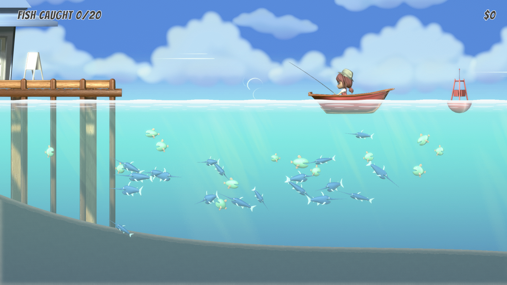
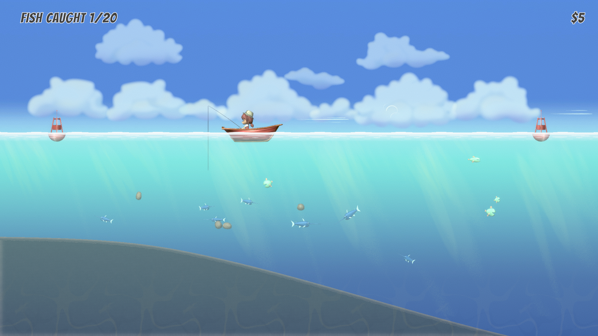
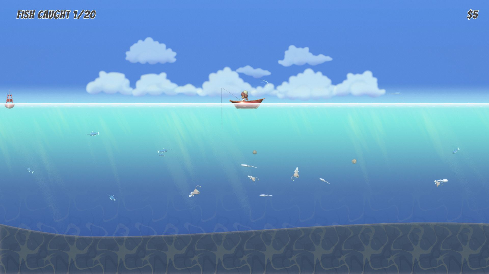

# GoneFishing

Gone Fishing is created in Unity Engine. A video of the project can be found [here](https://www.youtube.com/watch?v=bcrtBni0NjI)

## The objective
The game objective is to upgrade your fishing capabilities. You start out with a small fishing line that has almost no attraction to the fish and a low capacity to hold fish. Upgrades start cheap, but get more and more expensive. As you upgrade your boat and fishing line, you can get to further zones that have different fish in them that are worth more.

### Some techniques used in this game:
- Basic 2d character controller.
- Procedural mesh generation for the water and ground.
- Behavior programming for the fish.
- Custom shader creation.
- UI programming for the shop and main menu.

